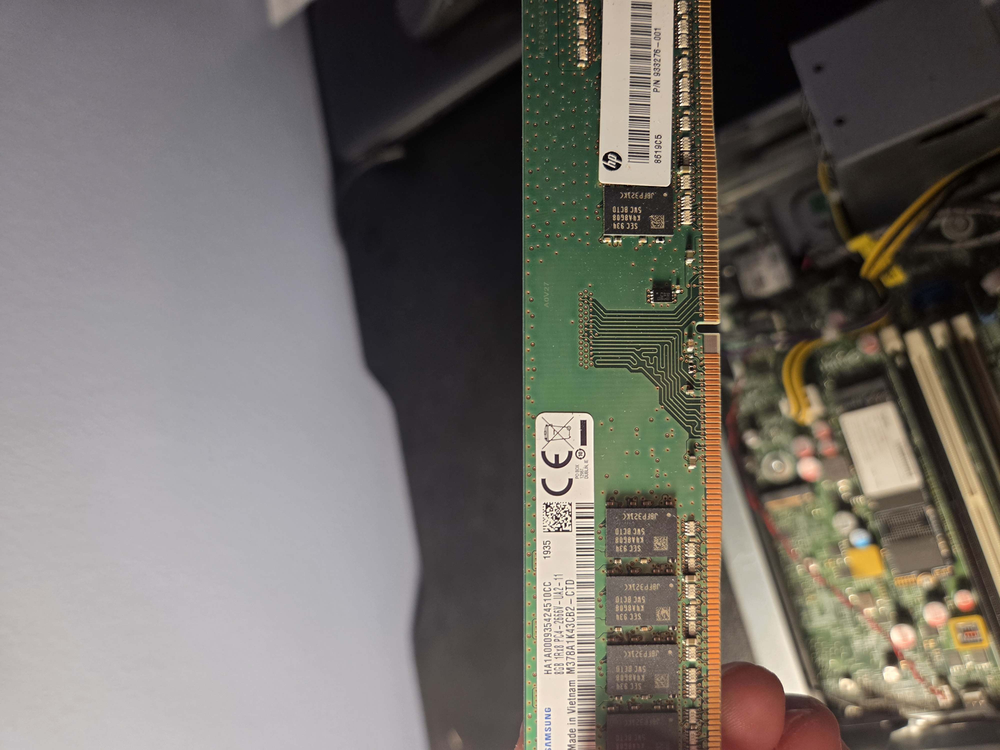
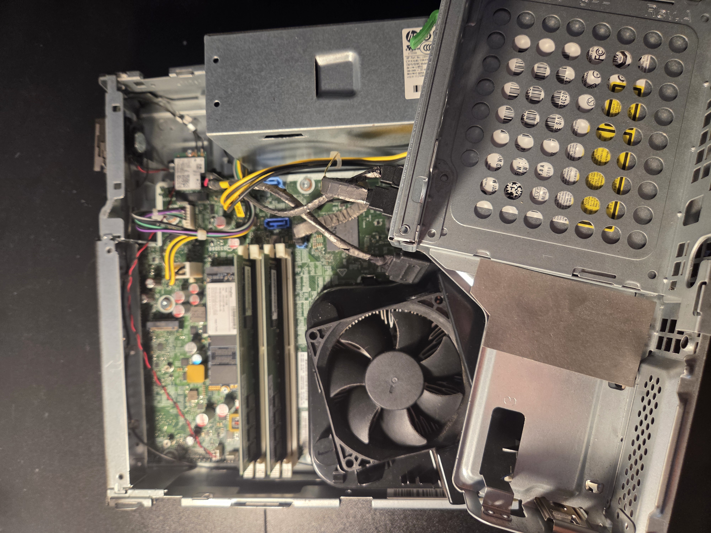
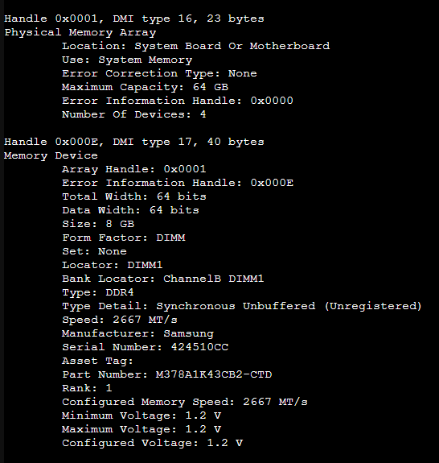
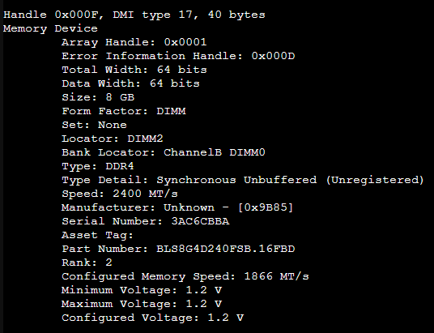

## Upgrading RAM in Elitedesk host

I intend to add these spare RAM sticks I had to the Elitedesk to comfortably add additional VMs

## Spare RAM:
Model: Ballistix by Micron
Size: 16GB DDR4
Speed: 2400 MHz ; Slower than whats in the host but more avalible RAM is more important at the moment.
Power: 1.2V

## Existing RAM

## Internals

## Old RAM specs

## New RAM specs

# The speed for all sticks lowered to 1866 MT/s, which is lower than expected. The amount of availble RAM has now doubled, so I will revisit the speed at another time. 
