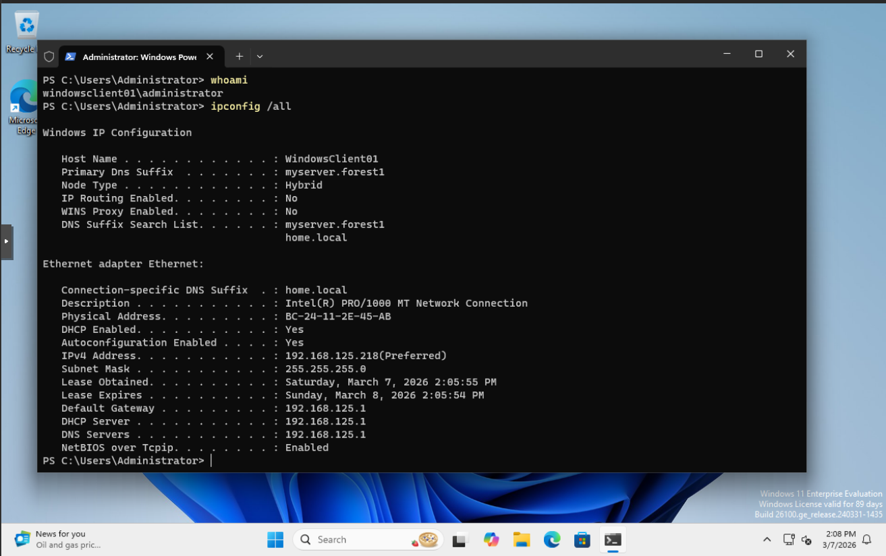

## Setting up DHCP on DC for web server and windows clients
  DHCP scope will be 192.168.100.10 through 192.168.100.100. The first 10 addresses im keeping reserved for future static addressess.
  Currently no exceptions will be needed.
  Name : scope1
  Lease duration : 8 days - Using defualt option as no mobile devices exist on the domain
  Default gateway : Blank for now, will configure when router/firewall gets configured
  DHCP scope configured
  
  Address Pool
  
  Home router is acting as rouge DHCP server
  
