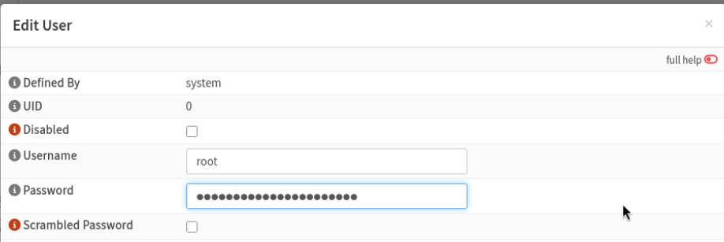

# Setup of domain firewall

Installed and configured OPNsense (26.1 Witty Woodpecker) to use as domain firewall

create new linux bridge

assign WAN and LAN interfaces

change cd/dvd type from ide2 > scsi to prevent the mounting filesystems hang

Set LAN interface to 10.0.0.1 temporarily

connected linux VM to vmbr1 to act as jump box and access FW web interface

ran opnsense installer then removed virtual disk

troubleshooting hanging pings from the kali box

<figure><figcaption></figcaption></figure>

diabled proxmox firewall on all network devices for firewall and kali

ran pfctl -d to disable the firewall rules temporarily

on kali box flushed ip neighbor to remove old mac address from opnsense

<figure><figcaption></figcaption></figure>

WAN connection is on DHCP and got an ip address, most likely the culprit causing ip conflict

I was using the same subnet for my homelab as my home network 192.168.125.x

I will change my interal addressing scheme to use the 10.0.0.0 subnet2

new addressing scheme removed the conflict and the kali box can now access the OPNsense web interface

<figure><figcaption></figcaption></figure>

Firewall is operational and I can now move on to configuring settings

Changing root password

<figure><figcaption></figcaption></figure>

Set External DNS servers

<figure><figcaption></figcaption></figure>

Add WAN GW on OPNsense using home router

<figure><figcaption></figcaption></figure>

Configure WAN interface

<figure><figcaption></figcaption></figure>

Update OPNsense firmware

<figure><figcaption></figcaption></figure>
