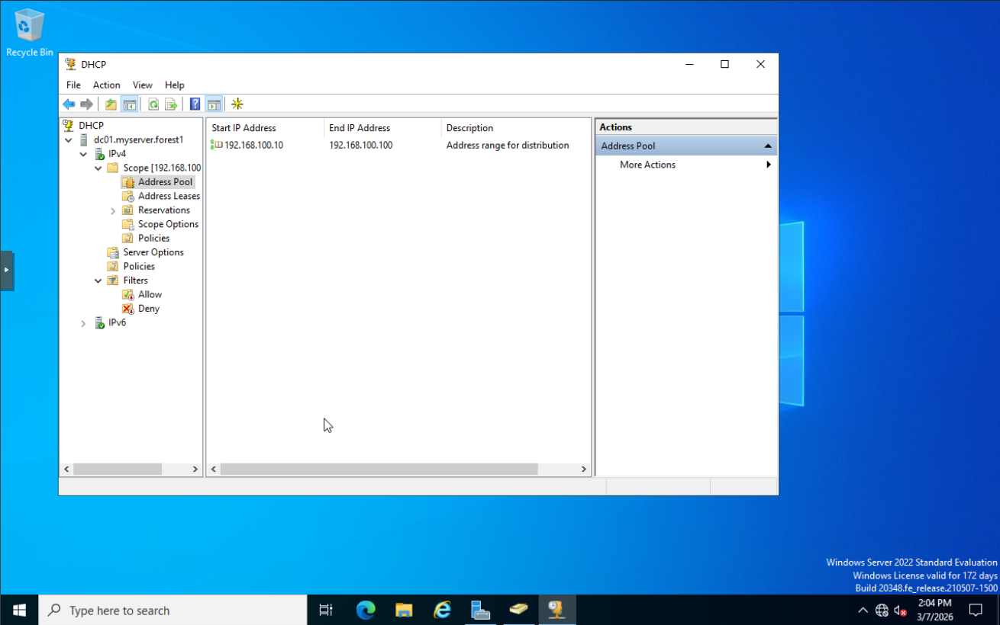
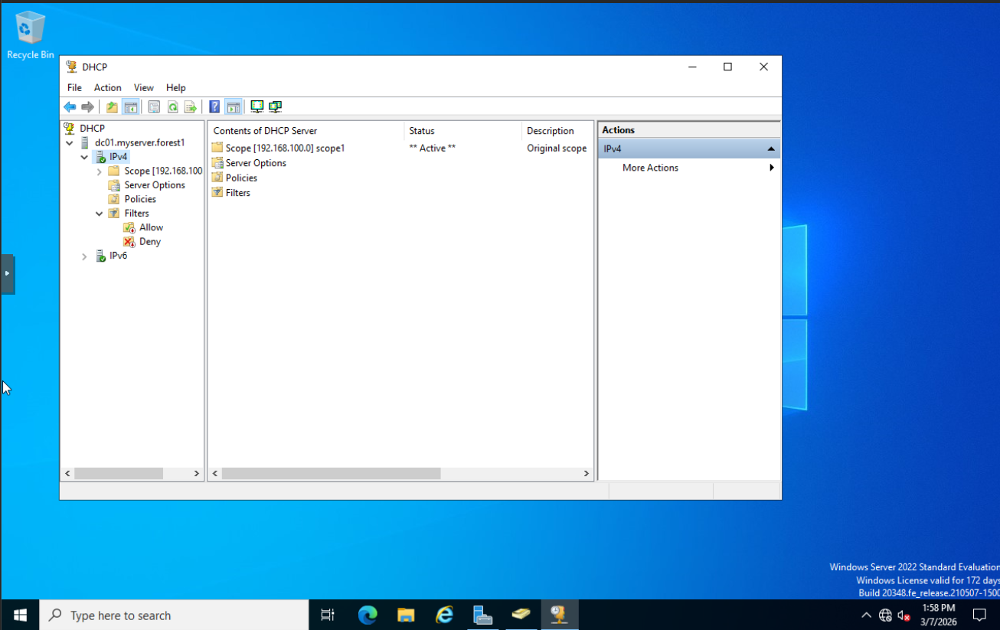

# Setting up DHCP on DC for web server and windows clients

DHCP scope will be 192.168.100.10 through 192.168.100.100. The first 10 addresses im keeping reserved for future static addressess. Currently no exceptions will be needed. Name : scope1 Lease duration : 8 days - Using defualt option as no mobile devices exist on the domain Default gateway : Blank for now, will configure when router/firewall gets configured DHCP scope configured  Address Pool  Home router is acting as rouge DHCP server - The router is handing out IP addresses before DC01 can. I will need to add a firewall for network segmentation before finishing DHCP setup.&#x20;

<figure><figcaption></figcaption></figure>

<figure><figcaption></figcaption></figure>

<figure><figcaption></figcaption></figure>
